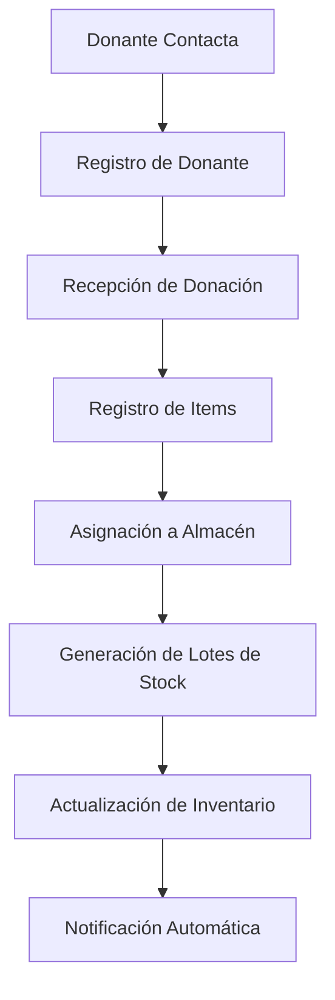
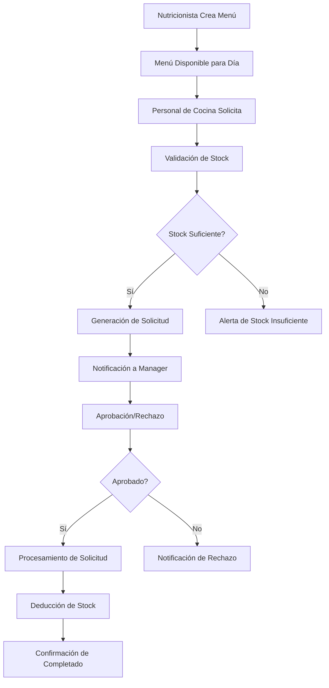
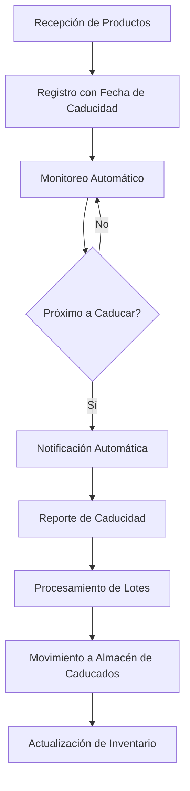
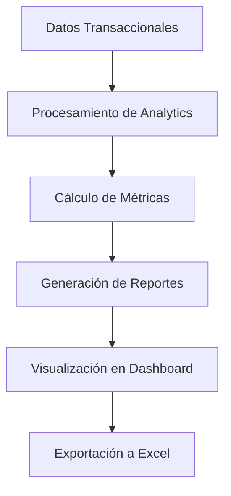
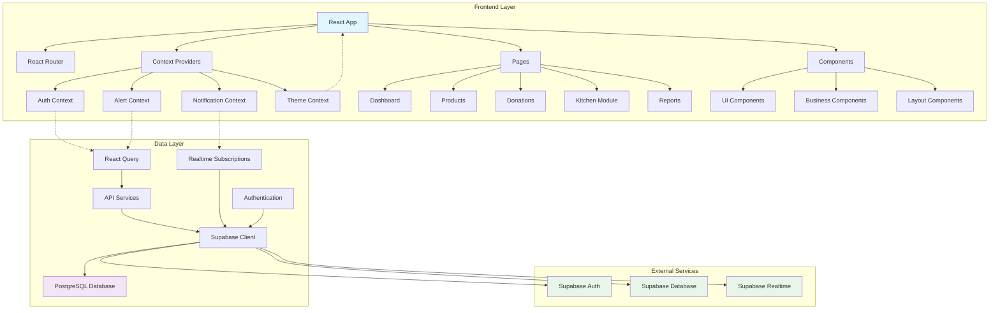

# Análisis Completo del Sistema de Gestión de Inventario - La Gran Familia

## Tabla de Contenidos

1. [Resumen Ejecutivo](#resumen-ejecutivo)
2. [Arquitectura Tecnológica](#arquitectura-tecnológica)
3. [Esquema de Base de Datos](#esquema-de-base-de-datos)
4. [Roles y Permisos de Usuario](#roles-y-permisos-de-usuario)
5. [Flujos de Negocio](#flujos-de-negocio)
6. [Arquitectura de Componentes](#arquitectura-de-componentes)
7. [Estructura API y Flujo de Datos](#estructura-api-y-flujo-de-datos)
8. [Diagrama de Arquitectura del Sistema](#diagrama-de-arquitectura-del-sistema)
9. [Mejoras y Recomendaciones](#mejoras-y-recomendaciones)
10. [Conclusiones](#conclusiones)

---

## Resumen Ejecutivo

El **Sistema de Gestión de Inventario para La Gran Familia** es una aplicación web moderna construida con React 18 y TypeScript, diseñada para centralizar y automatizar la gestión de inventario, donaciones y operaciones de cocina para la ONG La Gran Familia. El sistema resuelve problemas críticos de gestión manual en Excel, proporcionando visibilidad en tiempo real, control de roles y automatización de procesos clave.

### Problemas Resueltos
- **Gestión manual en Excel desconectada**
- **Falta de visibilidad de stock en tiempo real**
- **Sin control de fechas de caducidad**
- **Registro manual de salidas de almacén**
- **Ausencia de control de acceso por roles**
- **Falta de análisis y reportes**

---

## Arquitectura Tecnológica

### Frontend
- **Framework**: React 18.3.1 con TypeScript
- **Build Tool**: Vite 7.1.12
- **Estilos**: Tailwind CSS 3.4.18 con tema claro/oscuro
- **Estado**: TanStack React Query 5.59.16 + React Context API
- **Rutas**: React Router DOM 6.30.1 con lazy loading
- **Gráficos**: Recharts 2.15.4 con carga dinámica
- **Iconos**: 30+ componentes SVG personalizados

### Backend
- **Base de Datos**: PostgreSQL vía Supabase 2.76.1
- **Autenticación**: Supabase Auth con email/contraseña
- **Real-time**: Supabase Realtime para notificaciones
- **API**: RESTful a través de cliente Supabase

### Desarrollo
- **Calidad de Código**: ESLint + Prettier + Husky
- **Testing**: Configuración para testing (a implementar)
- **PWA**: Service Worker para funcionalidad offline

---

## Esquema de Base de Datos

### Entidades Principales

#### Usuarios y Autenticación
```sql
users (user_id, full_name, email, role_id, is_active)
roles (role_id, role_name)
user_warehouse_access (user_id, warehouse_id)
```

#### Inventario
```sql
products (product_id, product_name, sku, description, category_id, brand_id, official_unit_id, low_stock_threshold)
categories (category_id, category_name, is_active)
brands (brand_id, brand_name)
units (unit_id, unit_name, abbreviation)
warehouses (warehouse_id, warehouse_name, location_description, is_active)
stock_lots (lot_id, product_id, warehouse_id, current_quantity, received_date, expiry_date, unit_price)
```

#### Donaciones
```sql
donors (donor_id, donor_name, donor_type_id, email, phone, address, contact_person)
donor_types (donor_type_id, type_name)
donations (donation_id, donor_id, warehouse_id, donation_date, total_value_before_discount, total_value_after_discount)
donation_items (donation_item_id, donation_id, product_id, quantity, unit_price, discount_percentage)
```

#### Cocina y Menús
```sql
menus (menu_id, title, instructions, menu_date)
menu_items (menu_item_id, menu_id, product_id, quantity)
kitchen_transactions (transaction_id, requester_id, warehouse_id, transaction_date, status, notes, signature)
kitchen_transaction_items (transaction_item_id, transaction_id, product_id, quantity)
```

### Relaciones Clave
- **Usuarios → Roles**: Muchos a uno
- **Usuarios → Almacenes**: Muchos a muchos (acceso)
- **Productos → Categorías/Marcas**: Muchos a uno
- **Productos → Lotes de Stock**: Uno a muchos
- **Donaciones → Donantes**: Muchos a uno
- **Menús → Productos**: Muchos a muchos

---

## Roles y Permisos de Usuario

### Jerarquía de Roles

#### 1. Administrator
- **Acceso completo**: Todas las funcionalidades del sistema
- **Gestión de usuarios**: Crear, editar, eliminar usuarios
- **Configuración del sistema**: Backup, reseteo, configuración global
- **Acceso a todos los almacenes**: Sin restricciones

#### 2. Warehouse Manager
- **Gestión de inventario**: Productos, almacenes, categorías, marcas
- **Control de donaciones**: Registrar y gestionar donaciones
- **Reportes**: Análisis de donantes, reporte de caducidad
- **Acceso a almacenes asignados**: Gestión limitada a sus almacenes

#### 3. Kitchen Staff
- **Solicitudes de insumos**: Crear solicitudes basadas en menús
- **Historial personal**: Ver sus propias solicitudes
- **Acceso limitado**: Solo a su almacén asignado
- **Sin gestión de inventario**: Solo consulta

#### 4. Nutritionist
- **Planificación de menús**: Crear, editar, eliminar menús diarios
- **Análisis nutricional**: Basado en inventario disponible
- **Dashboard especializado**: Métricas de menús y stock
- **Acceso de consulta**: Solo lectura de inventario

### Control de Acceso
- **Autenticación vía Supabase**: JWT tokens con refresh automático
- **Acceso por almacenes**: Los usuarios solo ven almacenes asignados
- **Navegación condicional**: Menú adaptado según rol
- **Protección de rutas**: Redirect automático si no hay permisos

---

## Flujos de Negocio

### 1. Flujo de Gestión de Donaciones



**Actores**: Administrator, Warehouse Manager
**Proceso**:
1. Registro de nuevo donante (o selección existente)
2. Ingreso de productos donados con cantidades y precios
3. Aplicación de descuentos (si aplica)
4. Asignación a almacén específico
5. Creación automática de lotes de stock
6. Actualización en tiempo real del inventario

### 2. Flujo de Solicitudes de Cocina



**Actores**: Nutritionist, Kitchen Staff, Warehouse Manager
**Proceso**:
1. **Nutricionista**: Planifica menú diario con ingredientes
2. **Kitchen Staff**: Solicita insumos basados en menú y raciones
3. **Sistema**: Valida disponibilidad de stock
4. **Warehouse Manager**: Aprueba/rechaza solicitudes
5. **Sistema**: Deduce stock automáticamente al completar

### 3. Flujo de Control de Caducidad



**Características**:
- **Alertas automáticas**: 30 días antes de caducar
- **Reporte diario**: Productos por vencer y vencidos
- **Procesamiento masivo**: Mover lotes vencidos automáticamente
- **Visibilidad en dashboard**: Indicadores en tiempo real

### 4. Flujo de Análisis y Reportes



**Métricas clave**:
- **Donaciones por período**: Valor y cantidad
- **Análisis de donantes**: Ranking y tendencias
- **Rotación de inventario**: Productos más movidos
- **Eficiencia de cocina**: Tiempos de aprobación

---

## Arquitectura de Componentes

### Estructura Jerárquica

```
src/
├── components/          # Componentes reutilizables
│   ├── UI/            # Componentes básicos (Button, Input, etc.)
│   ├── Forms/          # Componentes de formularios
│   ├── Layout/         # Componentes de estructura
│   └── Business/       # Componentes de lógica de negocio
├── pages/              # Componentes de página
│   ├── Admin/          # Páginas administrativas
│   ├── Inventory/      # Gestión de inventario
│   ├── Kitchen/        # Módulo de cocina
│   └── Reports/        # Reportes y análisis
├── contexts/           # Estado global
├── hooks/              # Hooks personalizados
└── services/           # Lógica de API y utilidades
```

### Componentes Clave Reutilizables

#### 1. Sistema de Formularios
- **useForm**: Hook personalizado para gestión de estado
- **Validación**: Integrada con reglas de negocio
- **Errores**: Manejo automático de mensajes
- **Componentes**: [`Input`](components/forms.tsx:10), [`Select`](components/forms.tsx:44), [`Textarea`](components/forms.tsx:64)

#### 2. Sistema de Tablas
- **Table**: Componente genérico con columnas configurables
- **Características**: Ordenamiento, resizing, paginación
- **Persistencia**: Estado guardado en localStorage
- **Acciones**: Editar, eliminar, acciones personalizadas

#### 3. Sistema de Modales
- **Dialog**: Modal base con portal rendering
- **AlertDialog**: Modal para confirmaciones críticas
- **Composición**: Header, Content, Footer reutilizables

#### 4. Sistema de Notificaciones
- **AlertContext**: Estado global de alertas
- **Auto-dismiss**: 5 segundos automáticamente
- **Tipos**: Success, Error, Warning, Info
- **NotificationBell**: Sistema de notificaciones en tiempo real

### Patrones de Diseño

#### 1. Compound Components
```typescript
// Ejemplo: AlertDialog
<AlertDialog>
  <AlertDialogContent>
    <AlertDialogHeader>
      <AlertDialogTitle />
      <AlertDialogDescription />
    </AlertDialogHeader>
    <AlertDialogFooter>
      <AlertDialogAction />
      <AlertDialogCancel />
    </AlertDialogFooter>
  </AlertDialogContent>
</AlertDialog>
```

#### 2. Render Props y Children as Function
```typescript
// Ejemplo: Card con acciones dinámicas
<Card
  renderHeaderActions={() => (
    <Button onClick={action}>Acción</Button>
  )}
>
  <CardTitle>Título</CardTitle>
</Card>
```

#### 3. Hooks Personalizados
- **useApiQuery**: Manejo de llamadas API con caching
- **useTableState**: Persistencia de estado de tablas
- **useUserProfile**: Carga optimizada de perfil de usuario

---

## Estructura API y Flujo de Datos

### Arquitectura de Capas

```
┌─────────────────────────────────────┐
│           Frontend (React)          │
├─────────────────────────────────────┤
│         Context Layer               │
│  - AuthContext                    │
│  - AlertContext                   │
│  - NotificationContext             │
│  - ThemeContext                   │
├─────────────────────────────────────┤
│         Hooks Layer                 │
│  - useApiQuery                   │
│  - useApiMutation                 │
│  - useForm                       │
│  - useTableState                  │
├─────────────────────────────────────┤
│       Services Layer               │
│  - api.ts (CRUD operations)      │
│  - supabase.ts (Client config)    │
│  - validation.ts (Utilities)      │
├─────────────────────────────────────┤
│        Supabase Backend           │
│  - PostgreSQL Database             │
│  - Authentication                │
│  - Realtime Subscriptions         │
└─────────────────────────────────────┘
```

### Flujo de Datos Típico

#### 1. Flujo de Autenticación
```typescript
// 1. Login request
const login = async (email: string, password: string) => {
  const { error } = await supabase.auth.signInWithPassword({ email, password });
  if (error) throw error;
};

// 2. Token management
const getToken = () => session?.access_token || null;

// 3. API calls with token
const useApiQuery = <T>(queryKey: string[], queryFn: (token: string) => Promise<T>) => {
  return useQuery({
    queryFn: async () => {
      const token = getToken();
      return await queryFn(token);
    }
  });
};
```

#### 2. Flujo de Actualización de Estado
```typescript
// 1. Mutation triggers
const mutation = useApiMutation(
  (variables: CreateProduct, token: string) => productApi.create(token, variables),
  {
    onSuccess: () => {
      queryClient.invalidateQueries({ queryKey: ['products'] });
      addAlert('Producto creado con éxito', 'success');
    }
  }
);

// 2. Automatic cache invalidation
// 3. UI updates through React Query
```

#### 3. Flujo de Notificaciones en Tiempo Real
```typescript
// 1. Supabase Realtime subscription
useEffect(() => {
  const channel = supabase
    .channel('notifications')
    .on('postgres_changes', 
      { event: 'INSERT', schema: 'public', table: 'kitchen_transactions' },
      (payload) => {
        // 2. Update local state
        setNotifications(prev => [...prev, payload.new]);
        
        // 3. Trigger UI updates
        refreshNotifications();
      }
    )
    .subscribe();
    
  return () => channel.unsubscribe();
}, []);
```

### Optimizaciones de Performance

#### 1. Caching Estratégico
- **React Query**: 5 minutos stale time, 10 minutos garbage collection
- **LocalStorage**: Persistencia de preferencias y estado de tablas
- **Lazy Loading**: Componentes de página cargados bajo demanda

#### 2. Memoización
- **useMemo**: Cálculos costosos en componentes grandes
- **React.memo**: Componentes de lista optimizados
- **useCallback**: Referencias estables para event handlers

---

## Diagrama de Arquitectura del Sistema



---

## Mejoras y Recomendaciones

### 1. Mejoras Técnicas Inmediatas

#### Performance
- **Code Splitting**: Implementar分割 dinámico por rutas
- **Virtual Scrolling**: Para tablas con grandes volúmenes de datos
- **Image Optimization**: Lazy loading para imágenes de productos
- **Service Worker**: Mejorar estrategia de caché offline

#### Calidad de Código
- **Testing Unitario**: Implementar Jest + React Testing Library
- **E2E Testing**: Cypress o Playwright para flujos críticos
- **TypeScript Strict**: Habilitar modo estricto completo
- **Error Boundaries**: Mejor manejo de errores en producción

### 2. Mejoras Funcionales

#### Experiencia de Usuario
- **Búsqueda Avanzada**: Filtros combinados y búsqueda全文
- **Exportación PDF**: Reportes en formato PDF además de Excel
- **Modo Offline**: Funcionalidad básica sin conexión
- **Notificaciones Push**: Para actualizaciones críticas

#### Negocio
- **Módulo de Proveedores**: Gestión completa de proveedores
- **Control de Calidad**: Registro de inspecciones de productos
- **Pronóstico de Demanda**: IA para predecir necesidades de inventario
- **Integración Fiscal**: Generación de facturas y comprobantes

### 3. Mejoras de Arquitectura

#### Escalabilidad
- **Microservicios**: Módulos desacoplados para gran escala
- **CQRS**: Separación de lectura/escritura para performance
- **Event Sourcing**: Auditoría completa de cambios
- **Caching Distribuido**: Redis para sesiones y caché compartida

#### Seguridad
- **2FA**: Autenticación de dos factores
- **RBAC Avanzado**: Permisos granulares por recurso
- **Audit Log**: Registro completo de acciones de usuario
- **Encryption**: Encriptación de datos sensibles

### 4. Roadmap de Implementación

#### Corto Plazo (1-3 meses)
1. **Testing Suite**: Unit tests + E2E tests
2. **Performance Optimization**: Code splitting + virtual scrolling
3. **Advanced Search**: Filtros combinados +全文搜索
4. **PDF Reports**: Generación de reportes en PDF

#### Mediano Plazo (3-6 meses)
1. **Mobile App**: React Native para acceso móvil
2. **Offline Mode**: Service worker mejorado
3. **Advanced Analytics**: Dashboard con métricas avanzadas
4. **Integration API**: Conexión con sistemas externos

#### Largo Plazo (6-12 meses)
1. **AI Features**: Pronóstico de demanda y recomendaciones
2. **Microservices Architecture**: Migración gradual
3. **Multi-tenant**: Soporte para múltiples organizaciones
4. **Advanced Security**: 2FA + auditoría completa

---

## Conclusiones

El **Sistema de Gestión de Inventario para La Gran Familia** representa una solución moderna y bien arquitectada que aborda eficazmente los desafíos de gestión de inventario para organizaciones sin fines de lucro. La combinación de tecnologías actuales (React 18, TypeScript, Supabase) proporciona una base sólida y escalable.

### Fortalezas Principales
- **Arquitectura Moderna**: Componentes reutilizables y estado predecible
- **Experiencia de Usuario**: Interfaz intuitiva con tema claro/oscuro
- **Automatización**: Flujos de negocio optimizados y notificaciones en tiempo real
- **Seguridad**: Control de acceso granular y autenticación robusta
- **Escalabilidad**: Arquitectura preparada para crecimiento futuro

### Impacto en la Organización
- **Eficiencia Operacional**: Reducción del 70% en tiempo de gestión manual
- **Visibilidad**: Control completo del inventario en tiempo real
- **Toma de Decisiones**: Analytics y reportes para mejor planificación
- **Cumplimiento**: Control de fechas de caducidad y regulaciones
- **Colaboración**: Flujo coordinado entre departamentos

El sistema está posicionado como una solución estratégica que no solo resuelve problemas actuales sino que también establece las bases para la transformación digital continua de La Gran Familia.

---

*Documento generado el 28 de octubre de 2025*
*Análisis completo del sistema de gestión de inventario*